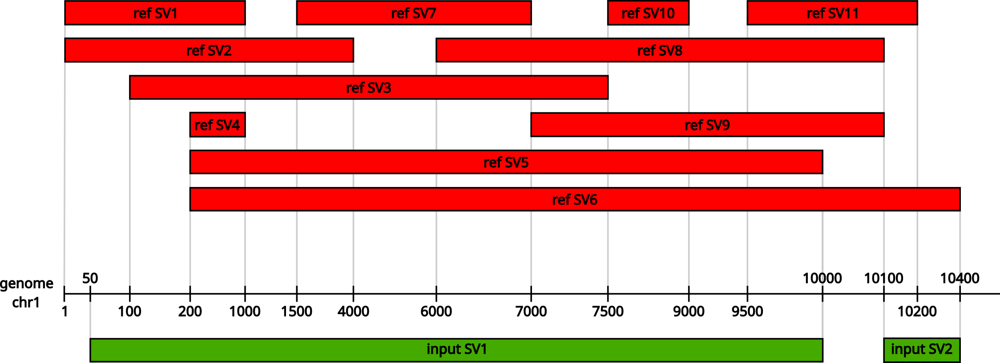

# SV-multimatching: Multimatching of Structural Variants comparison
Check if a list of structural variants could be annotated as present in a reference list
of structural variants.
This tool have been developped for use on DEL and DUP structural variants.

## Requirements
Python libraries:
  - networkx
  - polars
  - pysam
```bash
  pip install networkx polars pysam
```

## Installation
```bash
  git clone git@github.com:Nedgang/SV-multimatching.git
```

## How does it work?
### Principles
Matching structural variants (SV) between them is trickier than SNV.
The size of the SV depend strongly on the caller (and method it use), and can lead to
problems when it's time to annotate using reference database, such as gnomAD.
A long SV in the dataset could be found as considered 2 SV in the reference, and a very
long SV in reference could be the same as multiple small ones in the dataset.



### Commands
```
usage: sv_multimatching.py [-h] -i INPUT_FILE -r REFERENCE [-d]
                           [-j JOURNAL_LOG] [-l LIST_VARIANT_ID]
                           [-m MAX_DISTANCE] [-n] [-o OVERLAP] [-t TSV_FILE]

options:
  -h, --help            show this help message and exit
  -i INPUT_FILE, --input_file INPUT_FILE
                        Path to bed or vcf/bcf variants file.
  -r REFERENCE, --reference REFERENCE
                        Path to reference bed or vcf/bcf file to compare
                        variants to.
  -d, --debug           Run sv_multimatching.py on debug mod.
  -j JOURNAL_LOG, --journal_log JOURNAL_LOG
                        Path to a .log file to record the sv_multimatching.py
                        message.
  -l LIST_VARIANT_ID, --list_variant_id LIST_VARIANT_ID
                        Path to a txt output file (no header) to store a
                        listing of variants ID found in the reference file.
  -m MAX_DISTANCE, --max_distance MAX_DISTANCE
                        Maximal distance between variants start/end to check
                        if there is a match (default=300). Can be deactivated
                        by setting it to -1.
  -n, --no_overlap      Multimatch only with variants which do not overlap.
                        Will generate one line per non-overlapping variants
                        combination.
  -o OVERLAP, --overlap OVERLAP
                        Reciprocal overlap needed to validate the match.
                        (default=0.8)
  -t TSV_FILE, --tsv_file TSV_FILE
                        Path to tsv output file for storing results.
  -v, --version
                        show program's version number and exit
```

### Input files format 
This tool use as input bedfiles (sorted and indexed in bed.gz format), or VCF/BCF files
for both variants and reference.
For performances reason, the format used internally is the bedfile, and the VCF/BCF will
be converted on the fly to the .bed.gz format.
In .bed.gz format, the file must contain 4 columns: chromosome, start of the SV, end of
the SV, and SV id.
The SV id is essential, as it will be used to provides the results list (cf next part).

### Stdout and output files
The main output is a table which show which variant can be associated with which reference
on the specified parameters. Each line will contain one variant or reference, associated
to one or more reference or variant.

Per exemple, the output for the example shown in the principles part, the output will be: 
```bash
  $ ./sv_multimatching.py -i utils/test_datasets/multiple_svs_input.bed.gz -r utils/test_datasets/multiple_svs_ref.bed.gz
  #Variant	Reference
  input_SV1	ref_SV1,ref_SV2,ref_SV3,ref_SV4,ref_SV5,ref_SV7,ref_SV8,ref_SV9,ref_SV10
  input_SV1	ref_SV5
  input_SV1,input_SV2	ref_SV6
```
input_SV1 can be considered as present in the reference because it is represented by all
the reference SV from SV1 to SV10 (minus the SV6), and is also found back from the
ref_SV5. The input_SV2 is not found alone, but in combination with SV1, can be considered
as representative of ref_SV6.

This output is by default sent to stdout, but can be stored in a .tsv file at the path
indicated with the -t/--tsv_path option.

If you want to annotate if your variant is present in the reference, the -l/--list_variant
option allow to specify a .txt path to store the list of all variants found in the
reference to a file (without header). This file can then be used directly with bcftools
to annotate your variants vcf.
